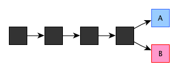

对于双花问题，比特币网络，或者说区块链网络，是这么应对的：

-每笔交易都需要先确认对应比特币之前的状态，如果它之前已经被标记为花掉，那么新的交易会被拒绝。

-如果先发起一笔交易，在它被确认前，也就是这个时间段的交易还未被记账成区块block时，进行矛盾的第二笔交易，那么在记账时，这些交易会被拒绝。

-上面只是小伎俩，现在tricky的部分开始了。如果诈骗者刻意把第一笔交易向一半网络进行广播，把第二笔交易向另一半网络广播——这个诈骗者智商还挺高——然后两边正好有两个矿工几乎同时取得记账权，把各自记的block发布给大家的话（这个概率很低），网络是不是会混乱呢，区块链的规则是这样的：先选择任意一个账本都可以，这时候原来统一的账本出现了分叉：

  

但是在两个账本中各只有一笔交易，诈骗者不会有好处。接下来，下一个矿工选择在A基础上继续记账的话，A分支就会比B分支更长，根据区块链的规则，最长的分支会被认可，短的分支会被放弃，账本还是会回归为一个，交易也只有一笔有效：

  

-那么如果这个诈骗犯真的智商非常高，他会这么做：如果是A分支被认可（B也一样），相应交易确认，拿到商品之后，立刻自己变身矿工，争取到连续两次记账权，然后在B分支上连加两个block，就像这样：

  

于是B分支成为认可的分支，A被舍弃，A分支中的交易不再成立，但他已经拿到商品，诈骗成功。

在B分支落后的情况下要强行让它超过A分支，其实是挺难的，假设诈骗者掌握了全网1%的计算能力，那么他争取到记账权的概率就是1%，两次就是10的负4次方。但这个概率还没有太低。

应对办法呢？建议大家在一笔交易确认后，也就是一个block被记下来之后，再等5个block，也就是等6个block被确认后再把交易对应的商品交付。这样，诈骗者还能追上的概率就几乎为0了。除非……

如果诈骗者掌握了全网50%以上的计算力，那么，即使落后很多，他追上也只是时间问题，这就是比特币的“51%攻击”。

这就是区块链需要警惕的问题。虽然在比特币网络中，用户已经极多，全网算力总和非常大，如果真掌握50%以上，也不用靠这个诈骗了，挖矿的收益都更高。但是在小的区块链网络中呢？况且，没有50%以上的算力，还是有机会成功的，只是概率低而已。
